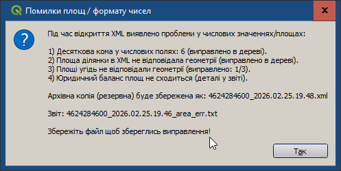

# Експрес контроль при відкритті XML-файла

При відкритті XML-файла, плагін автоматично проводить наступні перевірки:

1. відсутність "десяткової коми" як роздільника цілої і дробової частини;
   
2. відповідність обчисленої і зчитаної з XML-файла площі земельної ділянки;

3. відповідність обчислених і зчитаних з XML-файла площ угідь земельної ділянки;

4. відповідність суми площ угідь земельної ділянки площі земельної ділянки.

---
При виявленні таких помилок, плагін **xml_ua** виправляє їх автоматично, зберігаючи вихідний стан файлу (з помилками) як архівну копію (з назвою <назва_файлу>_РРРР.ММ.ДД.ГГ.ХХ.xml) у тій самій папці.
Звіт про всі зроблені зміни буде записаний у папці файлу з назвою <назва_файлу>_area_err.txt

