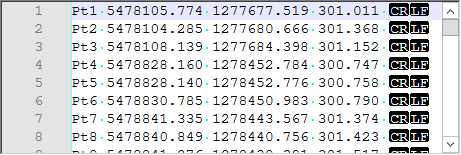
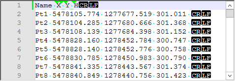
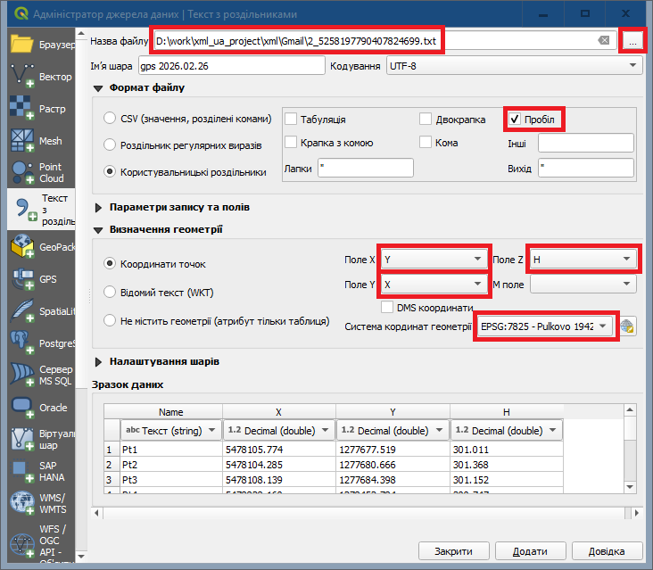

# Імпорт даних GPS

1. Відкрийте файл даних GPS редактором Notepad++:

2. Щоб не втратити першу точку, додайте перед першою стрічкою імена колонок:

3. Тепер цей файл можна імпортувати у QGIS.

- У меню Шар (Layer) -> Додати шар (Add Layer) -> Додати шар текстового файлу з розділювачами... (Add Delimited Text Layer...).

 
- При імпорі, зверніть увагу на елементи управління, виділені червоним кольором (зокрема X це Y, а Y це X).

4. Створіть лінійний (для суміжників) і полігональний (для ділянок, угідь тощо) шари.

5. Обведіть суміжників, ділянку, угіддя тощо.

6. Геометрію цих об'єктів пізніше буде застосовано до відповідних елементів xml-файла. 
