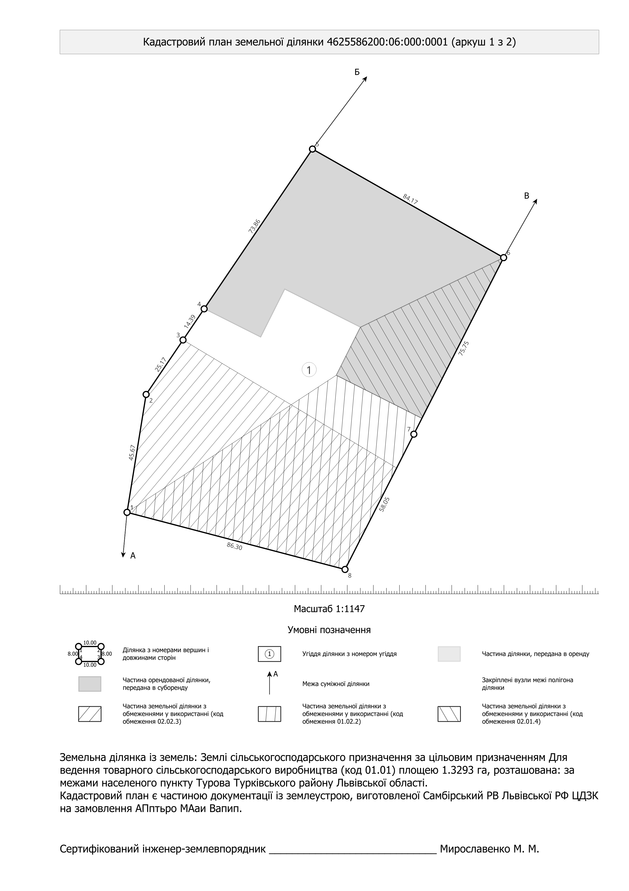
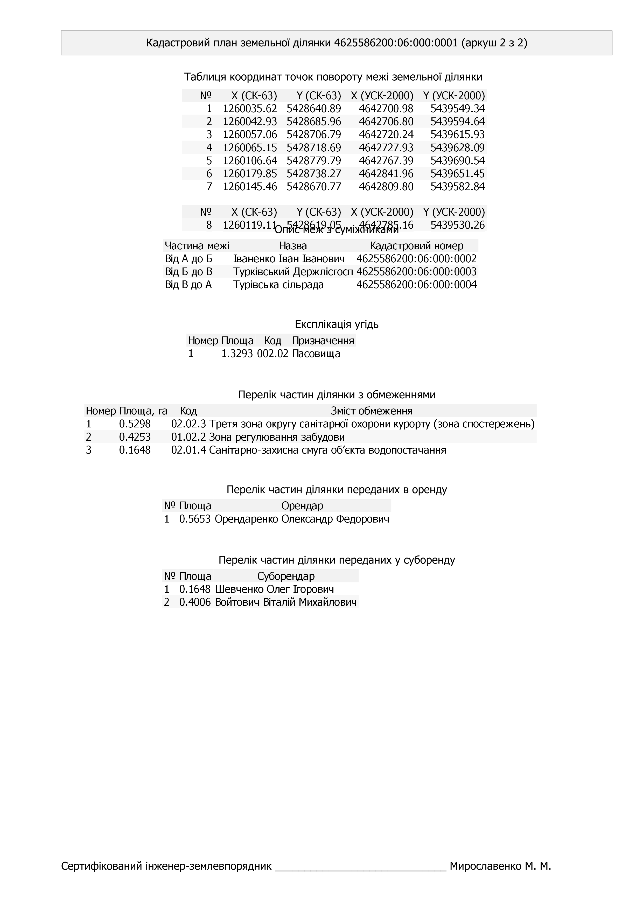
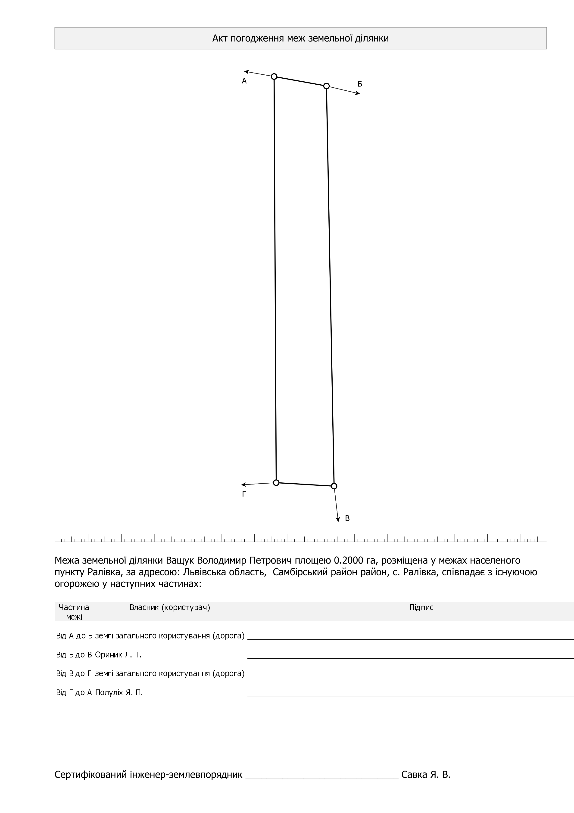

# Графічні документи (карти, плани, схеми)

У землевпорядній практиці “графічні документи” — це файли, де головне не текст, а **картографічне зображення**: план, схема, підписи на карті, рамка, масштаб, північ, таблиці/штампи. Зазвичай їх здають у форматі **PDF** (інколи PNG/JPG для попереднього перегляду).

На цій сторінці:

1) коротко — як робити графічні документи в QGIS через **Макети (Print Layout)**;  
2) детальніше — про **кадастровий план** і **акт погодження меж**, які можна сформувати в плагіні `xml_ua`.

---

## 1) Як робити графічні документи в QGIS (через Макети)

У QGIS для друку/експорту карт використовується інструмент **Print Layout** (укр. “Макет друку”, “Макети”).

Типовий алгоритм:

1. Відкрийте **Менеджер макетів** (Layout Manager) і створіть новий макет.
2. Додайте на сторінку **карту (Map item)**.
3. Налаштуйте **масштаб**, **рамку**, **поля**, за потреби — **сітку/координатну рамку**.
4. Додайте стандартні елементи: **лінійка масштабу**, **стрілка півночі**, **легенда**, **підписи**, **штамп/таблиці**.
5. Експортуйте в **PDF** (або в зображення).

Офіційна документація QGIS:

- Print Layout (User Manual): https://docs.qgis.org/latest/en/docs/user_manual/print_layout/index.html

> Порада студенту: якщо вам треба багато однотипних планів (для різних ділянок), у QGIS є “Atlas” — він автоматично проганяє макет по об’єктах шару й експортує серію сторінок.

---

Плагін xml_ua створює графічні документи у сучасному стилі - шрифтом одного розміру, без зайвих стрілок, рамок, які не несуть інформації. 

---
## 2) Кадастровий план (у більшості землевпорядних документацій)

### Що це таке

**Кадастровий план** — це графічний документ, де наочно показано:

- межу земельної ділянки;
- “суміжників” (сусідні землекористування/ділянки), напрями меж суміжних ділянок;
- ключові підписи (унакльні номери вершин, довжини ліній, площа тощо);
- службові елементи: масштаб, масштабна лінійка, таблиці тощо.
---

Кадастровий план (аркуш 1)

---

Кадастровий план (аркуш 2)

---

#### Стиль кадастрового плану

У старих стилях масштаб ділянки вибирався з списку 1:500, 1:1000, 1:2000, ... При цьому ділянка не завжди мала оптимальний розмір. Плагін **xml_ua** дозволяє вибрати максимально великий масштаб для ділянки, при цьому, для допитливих, внизу зображається мірна лінійка.

Таблиці, які можуть мати від кількох до кількох десятків рядків не ліпляться на одному аркуші шляхом зменшення розміру шрифта.

Таблиці відображаються у стилі "зебра": заголовок на сірому фоні, рядки з парними номерами мають світло сірий фон.

Необхідні таблиці послідовно додаються на нові аркуші, які мають наскрізну нумерацію і підписуються окремо.

### Як сформувати кадастровий план у плагіні (кроки)

1. Відкрийте або створіть потрібний `.xml` у `xml_ua`.
2. Переконайтесь, що ділянка та підписи на карті виглядають коректно.
3. Оскільки одночасно може бути відкритими більше одного xml, клацніть на шар ділянки, для якої треба сформувати план, щоб шар виділився темно-синім кольором.
4. У меню плагіна відкрийте розділ **Документація** і виберіть **Кадастровий план**.
5. Плагін xml_ua створить макет Кадастрового плану для вибраного шару і відкриє його. 

Див. також: [Меню плагіна](interface_menu.md).

### Особливості кадастрового плану

В зоні житлової забудови, особливо у великих містах, на ділянці може бути кілька зон обмежень, які можуть перекриватись. Для однозначної ідентифікації таких зон на кадастровому плані, єдиний спосіб - унікальний кут штриховки, і опис всіх зон обмежень і легенді кадастрового плану.

---

## 3) Акт погодження меж (схема + реквізити)

### Навіщо він потрібен

**Погодження меж** — це частина процесу, коли межу ділянки узгоджують із суміжними землекористувачами/власниками. У “паперовому” вигляді це зазвичай:

- таблиця/перелік суміжників (ПІБ/найменування, адреса, реквізити — залежить від форми);
- місця для підписів;
- графічна **схема**, де видно, по якій межі з ким суміжність.

### Як це реалізовано в `xml_ua` (принцип)

Плагін формує документ, використовуючи дані з вашого XML:

- список суміжників і пов’язані з ними межі;
- геометрію ділянки (щоб побудувати схему);
- підписи/нумерацію елементів (щоб було зрозуміло, яку частину межі погоджують).

Якщо у файлі не заповнені суміжники або межі “не читаються” (помилки топології/нумерації), акт вийде неповним або потребуватиме ручного доопрацювання — тому важливо спочатку пройти валідацію та візуальну перевірку.

### Як сформувати акт погодження меж у плагіні (кроки)

1. Перевірте, що у вашому XML заповнені суміжники та пов’язані дані.
2. У меню плагіна відкрийте розділ **Документація** і виберіть **Акт погодження меж**.
3. Перевірте, що у документі є схема та місця для підписів, і що суміжники відображаються коректно.

Акт погодження меж
---

