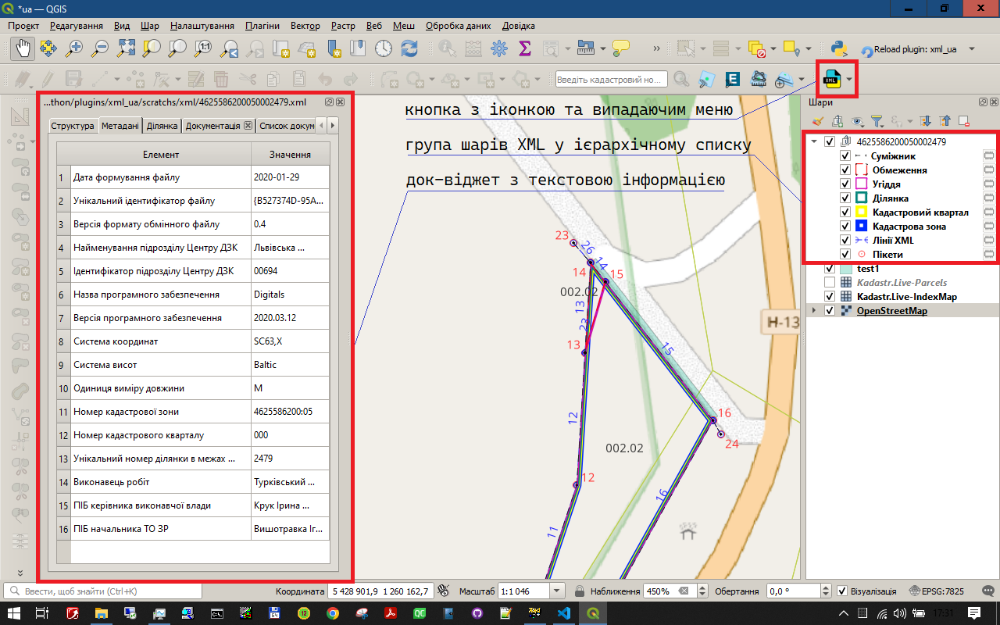

## Плагін xml_ua: Розбробка файлів обміну кадастровою інформацією у форматі XML

### 1. Опис

Плагін **xml_ua** призначений для роботи з xml - файлами обміну кадастровою інформацією в Україні, що відповідають XSD схемі версії 0.7 у середовищі QGIS. Він дозволяє відкривати, редагувати, перевіряти та зберігати ці файли, а також візуалізувати дані на карті QGIS.

Плагін **xml_ua** має відкритий самодокументований код, який розповсюджується під ліцензією GNU General Public License v3.0 (копілефт).

Плагін **xml_ua** "на льоту" перевіряє правильність редагування геометрії XML-файлу, та при наявності помилок інформує користувача.

### 2. Інтерфейс
Інтерфейс плагіну xml_ua має кнопку з іконкою та випадаючим меню, док-віджет з текстовою інформацією, групу шарів XML у ієрархічному списку та на карті.

Док-віджет з вкладками:

- Постійні вкладки:
  - Структура: Ієрархічне дерево XML-файлу. 
  - Метадані: Таблиця з загальною інформацією про XML файл. 
  - Ділянка: Таблиця з даними земельної ділянки. 
- Вкладки які створюються за необхідності і відображають інформацію про:
  - власників/користувачів
  - угіддя
  - обмеження
  - технічну документацію

Випадаюче меню кнопки тулбару містить пункти:

- Новий: Створення нового XML-файлу. 
- Відкрити: Відкриття існуючого XML-файлу. 
- Зберегти: Збереження поточного XML-файлу. 
- Зберегти як...: Збереження поточного XML-файлу під іншою назвою. 
- Перевірити: Перевірка XML-файлу на відповідність схемі. 
- Очистити дані: Очищення даних у док-віджеті. 
- Відновити закриті вкладки: Відновлення закритих вкладок. 

### 3. Функціонал
- Відкриття XML-файлу: Завантаження та парсинг XML-файлу. 
- [Створення нового XML-файлу](new_xml.md): генерація нового XML-файлу на основі користувацьких шаблонів, дозволяє уникнути повторного введення даних. 
- Редагування даних: зручне редагування метаданих та даних земельної ділянки в табличному вигляді та ієрархічному дереві.
- Редагування геометрії об'єктів: зручне редагування та контроль правильності змін геометричних об'єктів "на льоту". 
- Перевірка XML-файлу: Валідація XML-файлу на відповідність схемі XSD. 
- Збереження XML-файлу: Збереження змін у файлі. 
- Візуалізація та редагування геометричних об'єктів на карті: для наглядності дозволяє одночасно відобразити всі шари та елементи XML 
  - суміжники
  - обмеження
  - оренда та суборенда
  - угіддя
  - ділянка
  - кадастровий квартал
  - кадастрова зона
  - лінії
  - точки
  
- Застосування індивідуальних стилів для окремих шарів та інструменту QGIS **"Наближення"** дозволяє [візуально перевірити відсутність типових помилок геометрії](visual_control.md).   

### 4. Порядок роботи з плагіном
Для використання плагіна необхідно:

- [Встановлення та налаштування QGIS.](install_qgis.md) 
- [Встановлення плагіну xml_ua в QGIS.](install_plugin.md) 
- Відкрити/створити проект QGIS, правильно вказавши [систему координат](crs.md). 
- Відкрити XML-файл або [створити новий](new_xml.md). 
- Відредагувати геометрію ділянки та інших графічних об'єктів. 
- Редагувати дані в таблицях та дереві. 
- Зберегти зміни. 

### 5. Помилки та зауваження
Плагін знаходиться на стадії розробки. Про виявлені помилки в роботі прохання повідомляти на електронну пошту, додаючи скріншоти помилок та файли xml з помилками.

### 6. Ліцензія
У частині створення та редагування файлів обміну кадастровою інформацією у форматі XML плагін **xml_ua** розповсюджується під ліцензією [GNU General Public License v3.0](https://www.gnu.org/licenses/gpl-3.0.en.html). 

### 7. Контакти
michael.krechkivski@gmail.com
