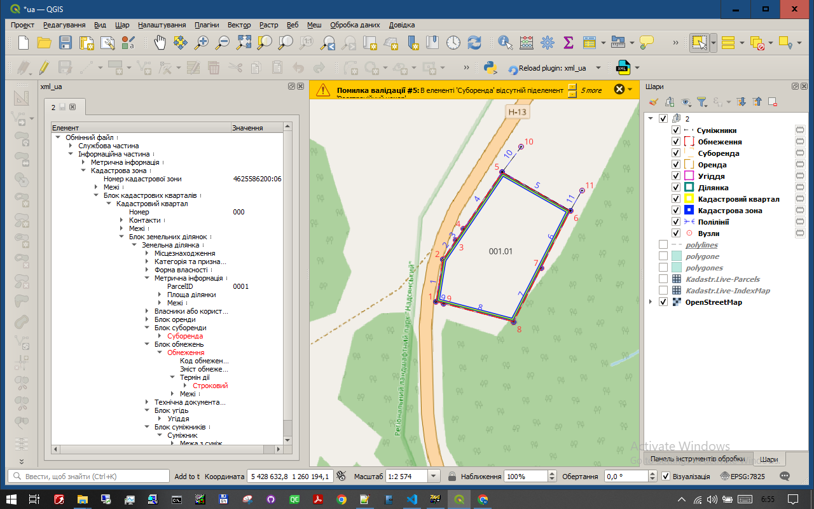

# Ласкаво просимо до документації плагіна XML-UA!

**XML-UA** — це плагін для <a href="https://www.qgis.org/" target="_blank">QGIS</a>, розроблений для спрощення роботи з обмінними файлами XML українського кадастру (<a href="https://zakon.rada.gov.ua/laws/show/1051-2012-%D0%BF#Text" target="_blank">електронних документів, що містять відомості про результати робіт із землеустрою та оцінки земель в електронному вигляді</a>). Він надає інструменти для візуалізації, редагування та перевірки кадастрових даних в сучасній ГІС.

## Для кого цей плагін?

Плагін буде корисним для широкого кола фахівців, що працюють із земельними даними в Україні:

*   **Сертифіковані інженери-землевпорядники та геодезисти:** для щоденної роботи зі створення, перевірки та редагування обмінних файлів.
*   **Співробітники органів місцевого самоврядування:** для аналізу та контролю кадастрової інформації на їхній території.
*   **Державні кадастрові реєстратори:** для візуальної перевірки геометрії та атрибутів перед внесенням даних до ДЗК.
*   **Студенти та викладачі:** для полегшення навчального процесу та практичного освоєння роботи з кадастровими даними в сучасному програмному забезпеченні.

## Основні можливості

*   **Створення нових XML-файлів** за результатами геодезичних вимірів.
*   **Візуалізація та редагування** топології XML, включаючи ділянки, угіддя, оренди та обмеження на рівні їх складових - вузлів та ліній.
*   **Інтерактивна перевірка** відповідності файлу до схеми XSD з підсвічуванням помилок.
*   **Зручне керування** відкритими файлами через вкладки та групи шарів.
*   **Створення шаблонів** для пришвидшення роботи з типовими проєктами.