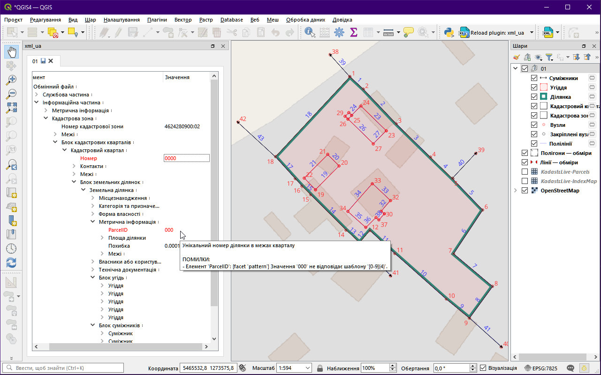

# **xml_ua**: кадастрові XML у QGIS 4

3D — вимога часу, тому **xml_ua працює в QGIS 4.** А поки ви працюєте з геометрією, плагін бере на себе рутину:

- **Автоматично коригує порядок додавання геометричних об’єктів і напрямок обходу контурів.**
- **Перевіряє дані просто під час роботи та одразу показує помилки й підказки.**

Менше ручних виправлень і здогадок — більше уваги до самих даних.

---

**xml_ua** — плагін для <a href="https://www.qgis.org/" target="_blank">QGIS</a>, у якому обмінний файл XML можна переглядати й редагувати як інтерактивну карту. Працюйте з кадастровими ділянками та пов’язаними з ними об’єктами, перевіряйте геометрію й атрибути та готуйте XML до збереження.

## Для кого xml_ua?

Для всіх, хто створює, перевіряє або редагує кадастрові дані в Україні:

* **Інженери-землевпорядники та геодезисти** — для роботи з XML і перевірки геометрії на кожному етапі.
* **Фахівці органів місцевого самоврядування та кадастрові реєстратори** — щоб переглядати й аналізувати кадастрові дані безпосередньо на карті.
* **Студенти й викладачі** — для практичної роботи з кадастровими даними у QGIS.

## Що він уміє?

* **Створення XML-файлів** за результатами геодезичних вимірювань.
* **Перегляд і редагування геометрії** ділянок, угідь, оренд, обмежень та інших об’єктів.
* **Автокорекція геометрії** — порядок додавання об’єктів і напрямок обходу контурів узгоджуються автоматично.
* **Перевірка під час роботи** — помилки підсвічуються, а підказки допомагають швидше зрозуміти, що потрібно виправити.
* **Візуальний контроль топології** — взаємне розташування вузлів і ліній видно на карті.
* **Робота з кількома XML-файлами** у вкладках і групах шарів.
* **Шаблони XML-файлів і документів із землеустрою** для типових робочих процесів.

## Що відбувається з моїми даними?

Плагін працює локально на вашому комп’ютері: кадастрові дані не потрібно передавати до хмарного сервісу. Його Python-код відкритий.

Під час відкриття XML-файлу плагін створює резервну копію. Зміни спершу вносяться у [тимчасові шари](./interface_layers.md#_3), тож вихідний файл не змінюється, доки ви не збережете результат. Якщо потрібно повернутися до початкової версії, скористайтеся [відновленням із резервної копії](./interface_menu.md#_8).

## Хочете розібратися у структурі XML?

---

Вимоги до змісту обмінного файлу визначає <a href="https://zakon.rada.gov.ua/laws/show/1051-2012-%D0%BF#Text" target="_blank">Порядок ведення Державного земельного кадастру</a>, затверджений постановою Кабінету Міністрів України № 1051. Для машинної перевірки структури XML використовується XSD-схема.

* <a href="xml_ua.xsd" download>Завантажити XSD-схему xml_ua</a>.

---

* <small>**Є запитання, знайшли помилку чи маєте пропозицію?** <a href="https://github.com/krechkivsky/xml_ua/issues" target="_blank">Створіть повідомлення на GitHub</a>.</small>
* <small>**Потрібен плагін?** <a href="https://github.com/krechkivsky/xml_ua/releases" target="_blank">Перегляньте релізи xml_ua</a>.</small>
* <small>**Шукаєте інструкції?** Перегляньте <a href="https://krechkivsky.github.io/xml_ua_docs/" target="_blank">документацію xml_ua</a>.</small>
