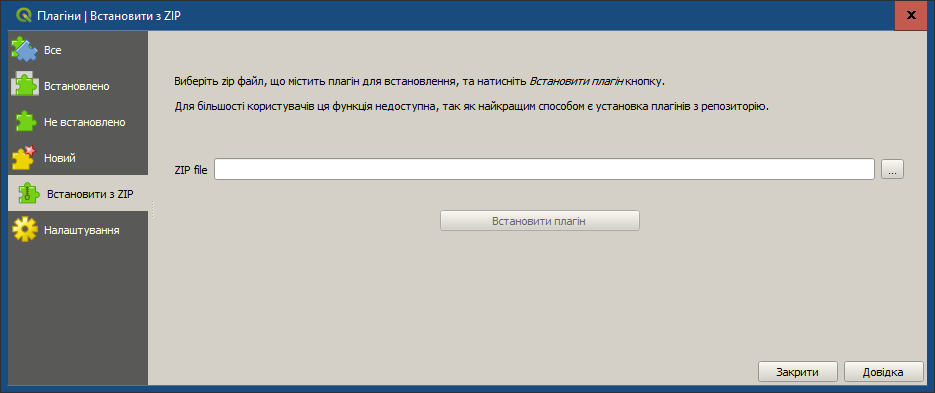
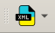

# Встановлення плагіна XML-UA

Оскільки плагін наразі не опублікований в офіційному репозиторії QGIS, встановлення відбувається з ZIP-архіву, завантаженого з GitHub.

## Передумови

Перед встановленням плагіна переконайтеся, що у вас встановлено QGIS. Якщо ні, будь ласка, зверніться до розділу [Встановлення QGIS](./install_qgis.md).

## Крок 1: Завантаження плагіна з GitHub

1.  Перейдіть на сторінку релізів проєкту на GitHub за посиланням:
    <a href="https://github.com/michael-krechkivski/xml_ua" target="_blank">**https://github.com/michael-krechkivski/xml_ua**</a>

2.  Знайдіть останній реліз (він буде вгорі списку).
3.  У секції **Assets** знайдіть та завантажте файл `xml_ua.zip`. Збережіть цей архів на вашому комп'ютері.

## Крок 2: Встановлення з ZIP-архіву в QGIS

1.  **Відкрийте QGIS.**
2.  Перейдіть до головного меню та виберіть **Плагіни** -> **Керування та встановлення плагінів...**.
3.  У вікні, що відкрилося, перейдіть на вкладку **Встановити з ZIP**.

    

4.  У полі **ZIP-файл**, натисніть кнопку `...` та виберіть завантажений раніше архів `xml_ua.zip`.
5.  Натисніть кнопку **"Встановити плагін"**.

6.  QGIS встановить плагін. Після появи повідомлення про успішне встановлення ви можете закрити вікно менеджера плагінів.

Після успішного встановлення на панелі інструментів QGIS з'явиться іконка плагіна **XML-UA** .
