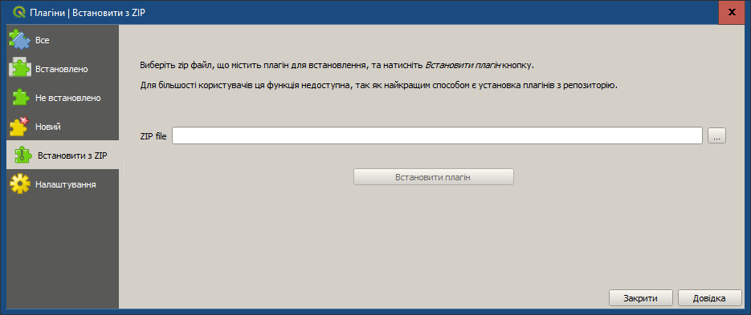
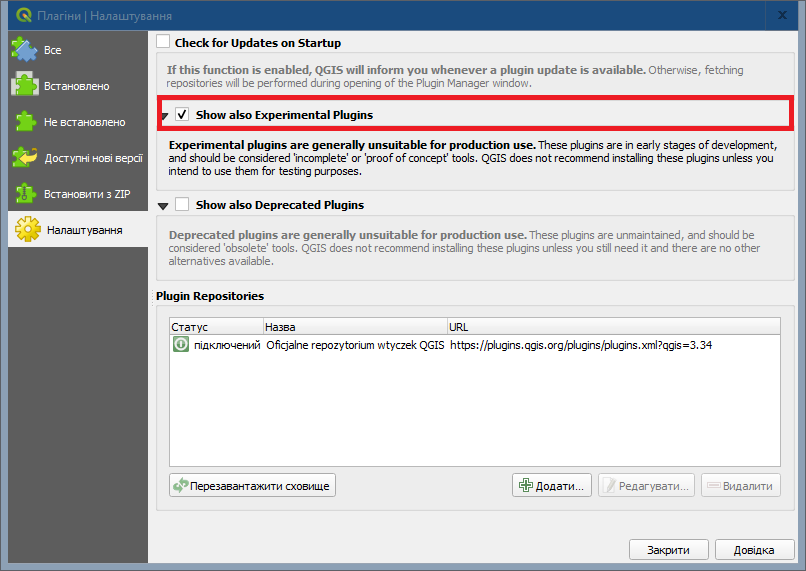
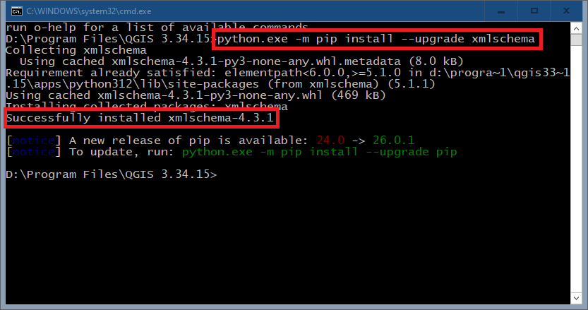
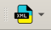

# Встановлення плагіна xml_ua

Оскільки плагін наразі не опублікований в офіційному репозиторії QGIS, встановлення відбувається з ZIP-архіву, завантаженого з GitHub.

## Передумови

Перед встановленням плагіна переконайтеся, що у вас встановлено QGIS 3.34.15. Якщо ні, будь ласка, зверніться до розділу [Встановлення QGIS](./install_qgis.md).

## Якщо потрібна остання версія, тоді тільки ZIP-архів з GitHub:

### Крок 1: Завантаження плагіна з GitHub

1.  Перейдіть на сторінку релізів проєкту на GitHub за посиланням:
    <a href="https://github.com/krechkivsky/xml_ua/releases" target="_blank">**xml_ua**</a>

2.  Знайдіть останній реліз та завантажте файл `xml_ua-vX.Y.Z.zip`. Збережіть цей архів на вашому комп'ютері.

### Крок 2: Встановлення з ZIP-архіву в QGIS

1.  **Відкрийте QGIS 3.34.15**
2.  Перейдіть до головного меню та виберіть **Плагіни** -> **Керування та встановлення плагінів...**.
3.  У вікні, що відкрилося, перейдіть на вкладку **Встановити з ZIP**.

    

4.  У полі **ZIP-файл**, натисніть кнопку `...` та виберіть завантажений раніше архів `xml_ua-vX.Y.Z.zip`.
5.  Натисніть кнопку **"Встановити плагін"**.

6.  QGIS 3.34.15 встановить плагін. Після появи повідомлення про успішне встановлення ви можете закрити вікно менеджера плагінів.

## Якщо підійде стабільна версія:

### Крок 1: Включіть експериментальні плагіни

1.  **Відкрийте QGIS 3.34.15**
2.  Перейдіть до головного меню та виберіть **Плагіни** ->
   


3. Включіть експериментальні плагіни



### Крок 2: Встановіть плагін з репозитарію QGIS


## Крок 3: Встановлення бібліотек 

1. Знайдіть і відкрийте папку, у яку встановлено QGIS 3.34.15. Як правило це: **C:\Program Files\QGIS 3.34.15** :


Запускаємо OSGeo4W.bat. У чорному вікні почергово інсталюємо бібліотеки:

```bash
python.exe -m pip install --upgrade xmlschema
```

```bash
python.exe -m pip install --upgrade docxtpl
```

```bash
python.exe -m pip install --upgrade pymorphy2 pymorphy2-dicts-uk
```
- Команди не миттєві (1 - 2 хвилини). Запускаємо кожну окремо і дочікуємось повідомлення про успішну інсталяцію бібліотеки.
- Текст команд можна копіювати з браузера і вставляти в командний рядок.
---

Результат має виглядати приблизно так:



На малюнку виділено команду інсталяції і повідомлення про успішне виконання.

---------

Якщо після встановлення на панелі інструментів QGIS не з'явилась іконка плагіна **xml_ua**  - перевантажте QGIS.
