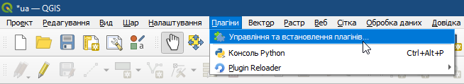
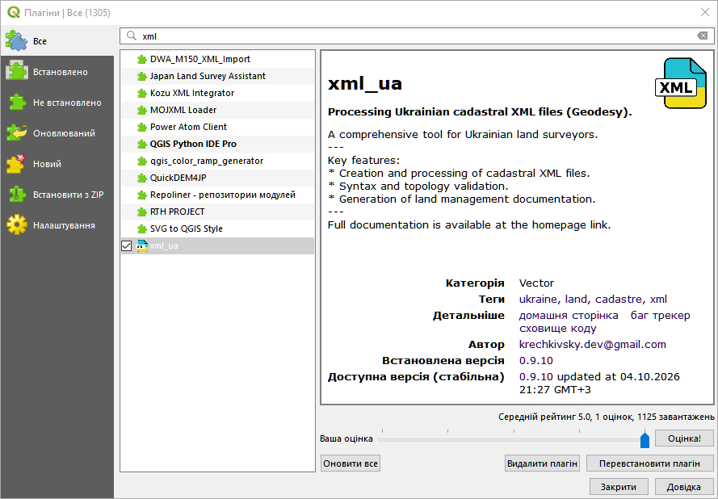

# Встановлення плагіна xml_ua

### Крок 1: Відкрийте вікно плагінів QGIS

Перейдіть до головного меню та виберіть **Плагіни** -> **Управління та встановлення плагінів**

----
### Крок 2: Встановіть плагін з репозитарію QGIS

Щоб не прокручувати великий список плагінів - напишіть у полі пошуку **xml**, поставте галочку навпроти **xml_ua** і натисніть кнопку **"Встановити плагін"**

------

