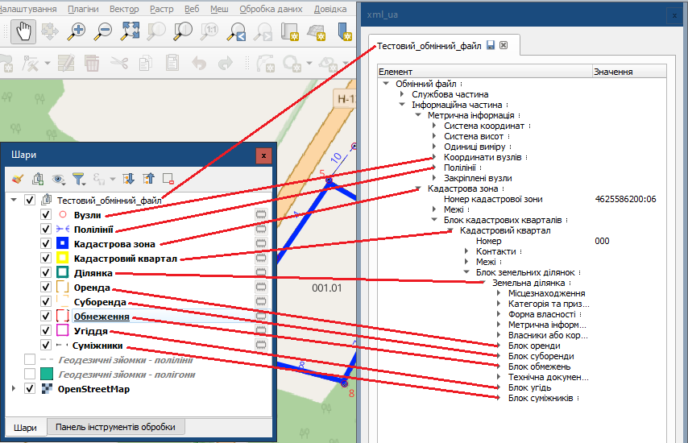

# Панель шарів

**Панель шарів** — це один з найважливіших елементів інтерфейсу QGIS. Уявіть, що це "зміст" вашої карти, де перелічені всі дані, які на ній відображаються. Ви можете вмикати або вимикати видимість шарів, змінювати їхній порядок, налаштовувати вигляд та багато іншого.

## Що таке шари?

Карта в QGIS — це набір прозорих "плівок" (шарів), накладених одна на одну. На кожній "плівці" зображено щось своє:

*   **Базова карта:** Це може бути супутниковий знімок з Google Earth, карта вулиць з OpenStreetMap або будь-який інший картографічний веб-сервіс. Вона слугує фоном.
*   **Векторні дані:** Це об'єкти з чіткими межами — точки, лінії та полігони. Наприклад, кадастрові карти, межі ділянок з попередніх зйомок, розташування комунікацій.
*   **Растрові дані:** Це зображення, що складаються з пікселів, наприклад, відскановані паперові карти або аерофотознімки.

Ви можете додавати на карту будь-яку кількість таких шарів, щоб аналізувати їх разом.

## Як плагін xml_ua використовує Панель шарів

Коли ви відкриваєте або створюєте новий XML-файл за допомогою плагіна **xml_ua**, він автоматично створює для цього файлу власну **групу шарів** на Панелі шарів.

*   **Назва групи** буде такою ж, як і назва файлу у вкладці віджета плагіна. Це дуже зручно, коли ви одночасно працюєте з кількома обмінними файлами — ви ніколи не заплутаєтесь, які шари до якого файлу належать.
*   **Всередині групи** плагін створює окремі шари для різних елементів XML-файлу: межі ділянки, угіддя, обмеження тощо.

## Зв'язок між шарами та структурою XML

Найголовніша перевага плагіна — це прямий візуальний зв'язок між тимчасовими шарами на карті та структурою самого XML-файлу у вікні плагіна. Кожен шар, який створює плагін, безпосередньо відповідає певному розділу (тегу) у дереві XML.

Це перетворює складну ієрархію XML на зрозумілу інтерактивну карту.

На ілюстрації, показано зв'язок між розділами XML (представленими українськими назвами) та шарами на карті.

Такий підхід дозволяє не просто бачити геометрію, а й розуміти, до якої частини електронного документа вона належить. Ви можете легко переходити від аналізу структури файлу до візуальної перевірки об'єктів на карті.

## Що означає значок мікросхеми?

Біля шарів, створених плагіном, ви побачите значок мікросхеми . Він означає, що це **тимчасовий шар** (або "шар у пам'яті").

Уявіть, що це наче нотатки на чернетці. Вони існують лише під час вашої поточної роботи в QGIS. Ці шари безпосередньо відображають геометричні дані з вашого XML-файлу. Якщо ви редагуєте XML у віджеті плагіна, зміни миттєво з'являються на цих шарах і навпаки.

**Важливо:** Оскільки ці шари тимчасові, вони зникнуть, якщо ви закриєте QGIS, не зберігши їх окремо.

### Збереження тимчасових шарів

Якщо вам потрібно зберегти геометрію з тимчасового шару для подальшої роботи (наприклад, для аналізу або передачі колегам), ви можете легко це зробити.

1.  Клацніть правою кнопкою миші на тимчасовому шарі.
2.  Виберіть в меню **Експорт -> Зберегти об'єкти як...**

Ви можете зберегти дані в різних форматах:

*   **ESRI Shapefile (`.shp`):** Найпоширеніший формат для обміну векторними даними.
*   **База даних PostGIS:** Потужне рішення для зберігання та керування величезними обсягами геопросторових даних. Це особливо корисно, коли ви працюєте з великою кількістю графічної інформації, наприклад, з кадастром цілого району чи міста.