# Меню плагіна

Усі основні функції плагіна **xml_ua** 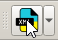 зібрані в одному зручному меню, яке з'являється після натискання кнопки випадаючого меню .

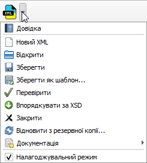
------

## Розглянемо призначення кожного пункту меню.

### Новий XML
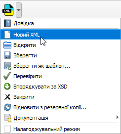

Створює новий обмінний файл XML. Ця функція дозволяє почати роботу "з нуля", використовуючи дані польових вимірювань і стандартний порожній шаблон, або один зі збережених вами шаблонів. Це особливо корисно, коли ви починаєте новий проєкт і хочете одразу заповнити його даними.

### Відкрити

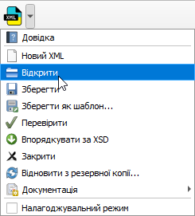

Відкриває існуючий XML-файл для перегляду та редагування. Плагін візуалізує всі дані з файлу (межі, угіддя, обмеження) у вигляді шарів на карті QGIS, головний док-віджет для роботи з атрибутами відкриється, якщо клікнути іконку плагіна.

### Зберегти

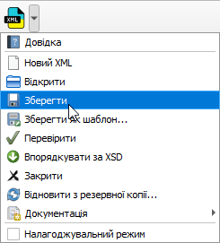

Зберігає всі зміни, внесені в поточний активний XML-файл. Ця кнопка стає активною лише тоді, коли у файлі є незбережені зміни (наприклад, ви змінили атрибут або перемістили точку).

###  Зберегти як шаблон...

Дозволяє зберегти структуру та атрибути поточного файлу (без геометрії) як шаблон для майбутнього використання. Це ідеальний інструмент для пришвидшення роботи з типовими проєктами, де багато реквізитів повторюються.

### Перевірити

Запускає валідацію (перевірку) поточного XML-файлу на відповідність офіційній схемі XSD. Якщо у файлі є помилки (наприклад, відсутній обов'язковий тег або некоректний формат даних), плагін підсвітить їх у дереві елементів.

### Впорядкувати за XSD

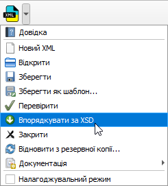

Впорядковує послідовність елементів у XML-файл після змін у відповідності до порядку у схемі XSD. 

### Закрити

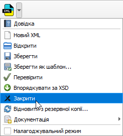

Закриває поточний активний XML-файл, а також видаляє з карти всі пов'язані з ним шари. Якщо у файлі були незбережені зміни, плагін запитає підтвердження перед закриттям.

### Відновити з резервної копії...

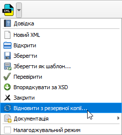

Дозволяє відкотити всі зміни в активному файлі до того стану, в якому він був на момент відкриття. Плагін автоматично створює резервну копію при відкритті кожного файлу, і ця функція дозволяє повернутися до неї, якщо ви зробили помилку, яку важко виправити.

### Документація

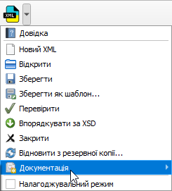

Тут можна створити титульні аркуші, пояснювальні записки, кадастровий план і акт погодження меж. Шаблони можна змінювати, створювати самостійно, або з допомогою ШІ, оскільки плагін має відкритий код. 

### Налагоджувальний режим

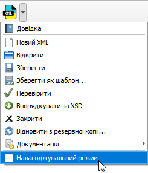
По замовчуванню налагоджувальний режим виключений, щоб не зменшувати швидкодію комп'ютера. Але, якщо щось не так, його можна включити: 

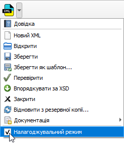,

повторити ситуацію, яка викликала помилку. Плагін запише виклики функцій і змінні в файл log.md. Лог можна проаналізувати самостійно, відіслати ШІ або на <a href="https://github.com/krechkivsky/xml_ua/issues" target="_blank">GitHub Issues</a>.

---   

