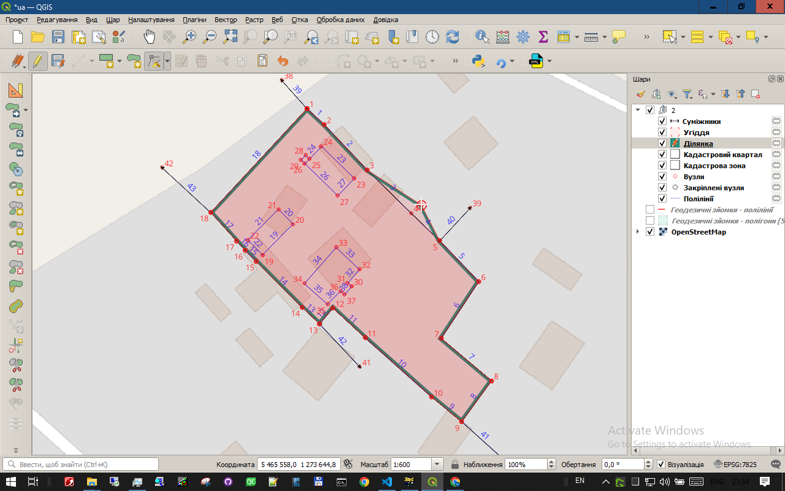
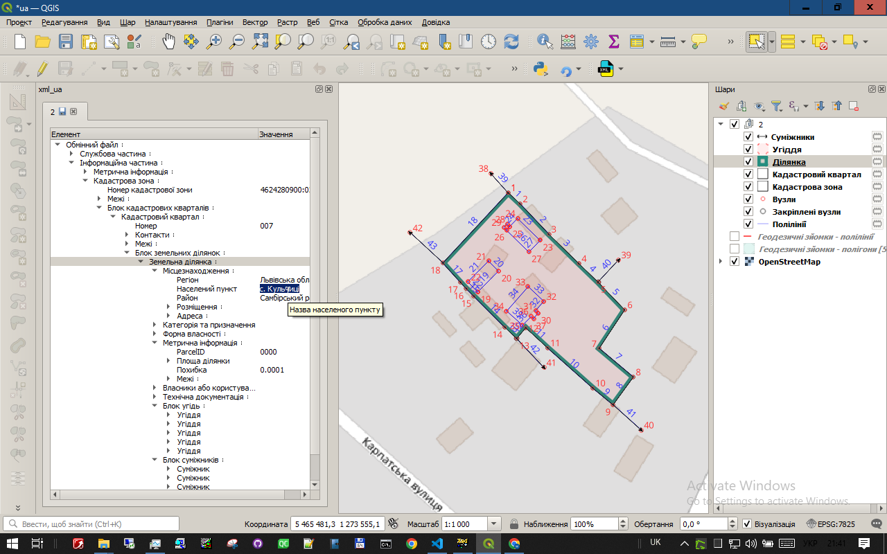

# Вікно плагіна (віджет)

Головний елемент інтерфейсу плагіна **xml_ua** — це спеціальне вікно, яке в термінології Qt називається `QDockWidget`. У віджеті відображаються відкриті/створені XML-файли. Його ключова особливість полягає в тому, що воно може існувати у трьох режимах, забезпечуючи гнучкість робочого простору.

## Режими роботи вікна

### 1. Прихований режим
 
Щоб зробити полотно карти максимально великим, по замовчуванню віджет прихований. В цьому режимі можна редагувати геометрію.  Переключення між прихованим та видимими  режимами: 

### 1. Прикріплений (задокований) режим

Цей режим для редагування атрибутів. Вікно плагіна "пристиковане" до однієї зі сторін головного вікна QGIS (зазвичай зліва). У цьому режимі воно є невід'ємною частиною інтерфейсу.

**Переваги:** Завжди знаходиться під рукою в одному і тому самому місці.

### 2. Плаваючий (вільний) режим

Ви можете "відкріпити" вікно плагіна, просто перетягнувши його за заголовок від краю вікна QGIS. У цьому стані воно перетворюється на самостійне вікно, яке можна вільно переміщати по екрану, змінювати його розміри і навіть переносити на інший монітор.

**Переваги:** Ідеально підходить для роботи з великими обсягами даних або на системах з кількома моніторами, звільняючи максимум простору для карти.

## Спливаючі підказки (Tooltips)

Плагін **xml_ua** має розвинуту та контекстно-залежну систему спливаючих підказок, яка слугує вбудованим довідником. Це не просто стандартні написи, а важливий інструмент, який надає нетривіальну та корисну інформацію, особливо для користувачів, які ще не досконало знайомі зі структурою XML-файлів.

Наприклад:

*   **Підказка на вкладці файлу:** Навівши курсор на заголовок вкладки, ви побачите повний шлях до відповідного XML-файлу на вашому комп'ютері.
  
*   **Підказка в дереві XML:** Наведення на будь-який елемент у дереві покаже його офіційний опис зі схеми XSD, пояснюючи його призначення.

## Інтерактивні елементи дерева XML

Дерево XML у плагіні — це не просто статичне відображення структури файлу. Багато елементів мають спеціальні позначки, які вказують на додаткові можливості взаємодії. Це робить роботу з файлом значно простішою та інтуїтивнішою.

### Значення символів біля назв елементів

*   **Без символу:** Якщо біля назви елемента немає жодних позначок, це означає, що його значення можна редагувати як звичайний текст у полі праворуч.

*   **Символ “↓” (Спеціальне введення):** Цей символ означає, що для редагування значення елемента використовується спеціальний віджет або діалогове вікно. Щоб його викликати, достатньо двічі клацнути лівою кнопкою миші на значенні елемента.
    *   **Приклад:** Подвійний клік на значенні елемента `FileGUID` відкриє діалог для автоматичної генерації нового унікального ідентифікатора, а подвійний клік на даті — зручний календар.

*   **Символ “⋮” (Контекстне меню):** Цей символ вказує на те, що елемент має спеціальне контекстне меню, яке викликається правою кнопкою миші. Це меню дозволяє динамічно керувати структурою XML.
    *   **Додавання/видалення елементів:** Меню показує, які дочірні елементи можна додати до поточного, або які з існуючих можна видалити, відповідно до правил офіційної схеми XSD.

### Важливість для навчання

Для студентів та фахівців, які тільки починають вивчати структуру кадастрових XML-файлів, ці інтерактивні елементи є надзвичайно корисними. Контекстне меню **“⋮”** фактично перетворюється на **наочний посібник**: воно не дозволить додати некоректний елемент і завжди підкаже, що саме можна додати в ту чи іншу частину документа. Це значно прискорює процес вивчення схеми та допомагає уникнути помилок при створенні файлів.
