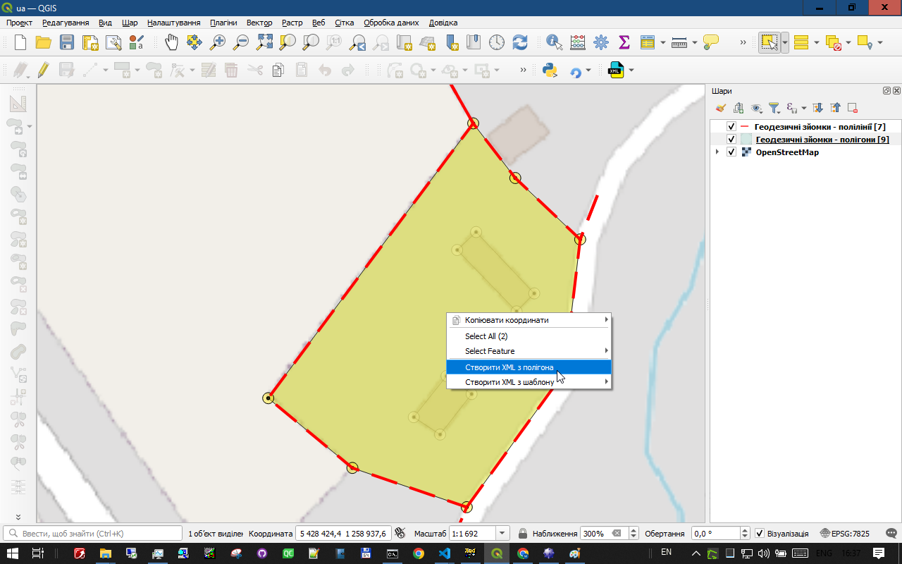
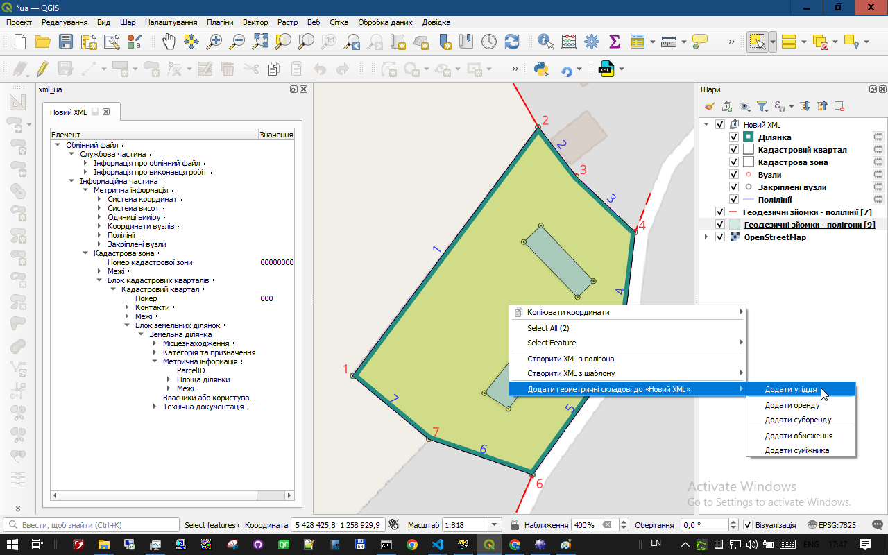

# Створення нового XML-файлу з геодезичних даних
-----

Ця сторінка описує найпоширеніший сценарій роботи інженера-землевпорядника: створення обмінного XML-файлу на основі даних, отриманих у результаті польових геодезичних вимірів.

Процес складається з кількох логічних кроків: підготовка вихідних даних, створення "каркасу" XML-файлу та послідовне наповнення його геометрією та атрибутами.

## Крок 1: Підготовка вихідних даних

З даних геодезичної зйомки створіть полігональний та лінійний шари, які містять полігони з межами  ділянки, її частин (угіддя, оренда тощо) та лінії суміжників.

## Крок 2: Створення "каркасу" XML-файлу

1.  Виберіть полігон ділянки на карті за допомогою інструмента "Виділити об'єкти".
2.  Клацніть на ньому правою кнопкою миші та в контекстному меню виберіть **Створити XML з полігона**. (Якщо у Вас вже є збережені шаблони xml, можна буде **Створити XML з шаблона**.)

Плагін автоматично виконає низку важливих дій:

* Визначить точки повороту межі ділянки.
* Створить з них полілінії, які складають полігон ділянки. 
* Пронумерує вузли (точки) та лінії межі за годинниковою стрілкою.
* Створить відповідні розділи дерева XML, головні з яких:
    - Координати вузлів
    - Полілінії
    - Кадастрова зона
    - Кадастровий квартал
    - Ділянка
та відповідні шари на карті.

## Крок 3: Додавання угідь та інших об'єктів

1. На **Кроці 2** ми вже задали назву нового XML-файлу. Тепер, коли виберемо полігон, з якого треба буде створити угіддя, його назва з'явиться у контекстному меню:
**Додати геометричні складові до "Новий XML" -> Додати угіддя**

2. Плагін запропонує вибрати з класифікатира код класифікації угіддя, додасть відповідний шар на карту та створить розділ **Блок угідь** та **Угіддя** у дереві XML.

3. Оренда, Суборенда, Обмеження, Суміжники додаються, за потреби, аналогічно

## Крок 4: Заповнення атрибутивних даних

Після того, як вся геометрія додана, вам залишається пройтися по дереву XML у вікні плагіна додати (за необхідності) та заповнити текстові поля: інформацію про власника, замовника, виконавця, номери суміжних ділянок тощо.
