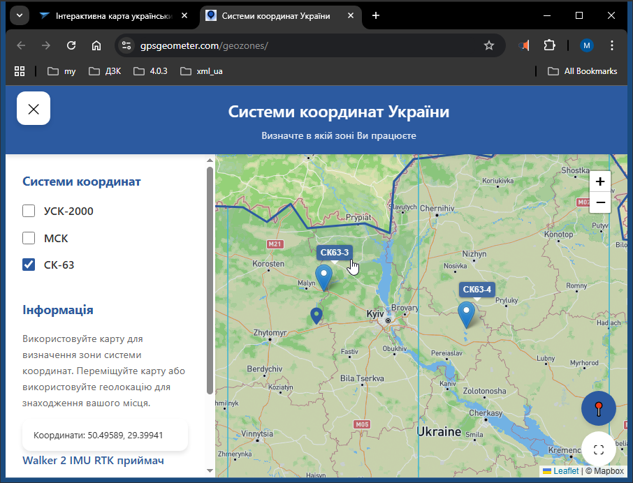
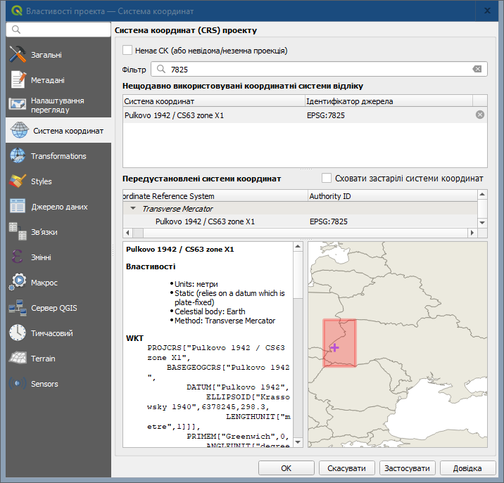

# Перед тим, як створювати або відкривати XML

----

Перед тим, як створювати або відкривати XML, слід правильно задати систему координат проекту, відповідну системі координат Ваших даних (Меню QGIS: Проект → Властивості → Система координат).

----
## Швидкий спосіб вибору (визначення) системи координат проекту:

----

## Детальніше (і трохи теорії):

1. Якщо вхідні дані в УСК-2000  то код EPSG проєкту вибирається з діапазону від 6381 до 6387. Приблизно його можна вибрати за червоним прямокутником на карті вікна вибору систем координат:

Точно встановити потрібний код EPSG УСК2000 можна за довготою:

19.5°–22.5° → 6381  
22.5°–25.5° → 6382  
25.5°–28.5° → 6383  
28.5°–31.5° → 6384  
31.5°–34.5° → 6385  
34.5°–37.5° → 6386  
37.5°–40.5° → 6387  

2. Якщо вхідні дані в СК-63 район X, то код EPSG проєкту вибирається з діапазону від 7825 до 7831. Приблизно його можна вибрати за червоним прямокутником на карті вікна вибору систем координат: 

Точно встановити потрібний код EPSG СК63 район X можна за довготою:

21.00°-24.00° → 7825  
24.00°-27.00° → 7826  
27.00°-30.00° → 7827  
30.00°-33.00° → 7828  
33.00°-36.00° → 7829  
36.00°-39.00° → 7830  
39.00°-42.00° → 7831  

