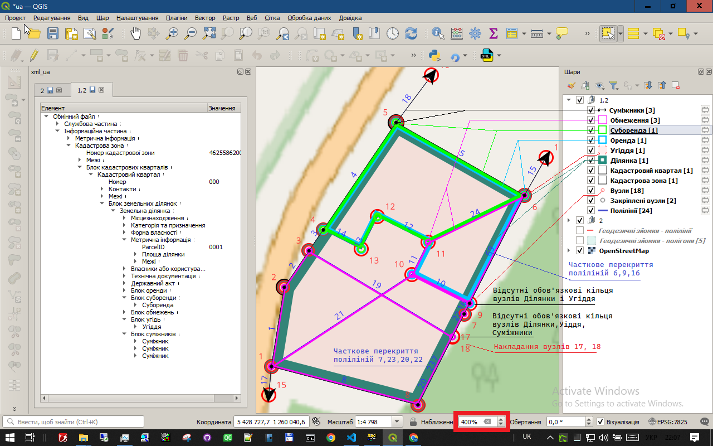

# Створні точки (або чому пряма не завжди пряма)

У світі геометрії Евкліда, через дві точки можна провести лише одну пряму. Але у світі кадастру та геодезії все трохи цікавіше. Іноді на ідеально прямій лінії з'являються "зайві" точки. Це і є наші герої — **створні точки**.

> **Створна точка** — це точка, яка лежить на прямій лінії (або настільки близько до неї, що відхилення менше за точність вимірювань) і не є поворотною.

## Звідки вони беруться?

Зазвичай, створні точки з'являються не в результаті польових вимірів (геодезист не ставить зайві віхи на прямій), а внаслідок камеральних робіт — тобто, геометричних обчислень в офісі.

Наприклад, вам потрібно "прив'язати" межу ділянки до кута будинку, межового знаку або краю дороги. Ви проєктуєте цей об'єкт на лінію межі, і в місці проєкції утворюється нова точка. Вона не змінює напрямок межі, але тепер є її частиною.

## Погляньмо на приклад

Давайте знову подивимось на наш малюнок з [попереднього розділу](./visual_control.md).

> **Наближення** - спеціальний інструмент у **QGIS**, який дозволяє побачити "конструкцію" вузлів та ліній.

> Звичайно при проектуванні ділянок **Масштаб 1:1000** і **Наближення 100%**. Змінювати ці значення можна просто коліщатком миші. 

На перший погляд, межа ділянки від вузла `2` до `5` — це пряма лінія. Але уважніше придивившись, ми бачимо на ній вузли **`3`** та **`4`**. Аналогічно, на відрізку між вузлами `6` та `10` знаходяться вузли **`7`**, **`9`**, **`17`**, **`18`**.

Це і є створні точки. Вони є повноцінними вузлами межі ділянки.

## У чому ж проблема?

Самі по собі створні точки не є проблемою. Проблема виникає, коли їх **ігнорують**.

У нашому прикладі, коли створювали суміжника (чорна штриова лінія), його провели від вузла `10` до `11`, повністю проігнорувавши існування вузлів `7` та `9`. В результаті ми отримали дві різні геометрії, які мали б бути однаковими:

*   Межа ділянки на цьому відрізку складається з точок: `... -> 6 -> 7 -> 8 -> 9 -> 1 -> ...`
*   Межа суміжника складається з точок: `10 -> 6 -> 8 -> 1 -> 11` (де лінія 10-11 проходить "над" 7 і 9).

Для комп'ютера (і для Державного земельного кадастру) це груба **топологічна помилка**. Межі не збігаються, хоча на карті виглядають однаково.

**Правильний підхід:** при створенні суміжника потрібно було вказати, що його межа проходить через ті ж самі точки: `7`, `9`.

Завдяки візуалізації в плагіні **xml_ua** ви можете легко помітити такі ситуації і переконатися, що всі ваші об'єкти (ділянки, суміжники, обмеження) використовують спільні вузли там, де їхні межі збігаються.