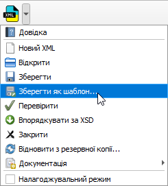
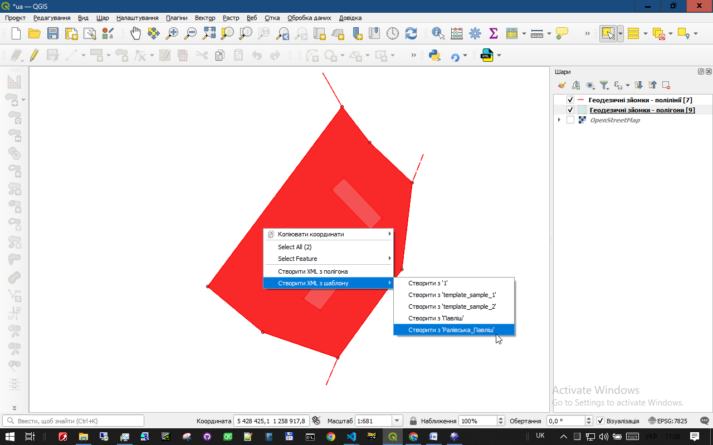
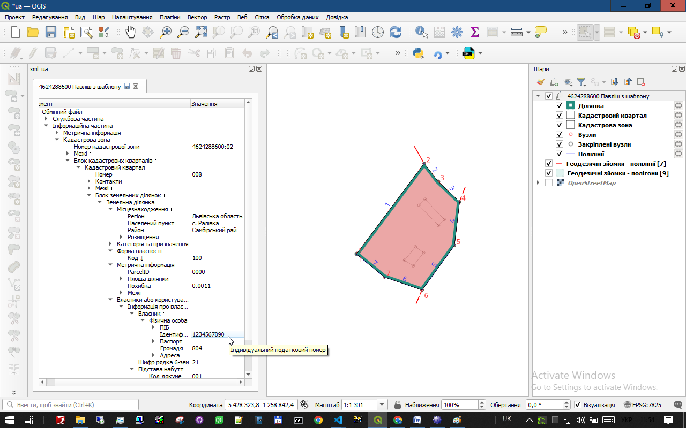

# XML-шаблони: Спрощуємо створення кадастрових файлів

Цей розділ допоможе Вам зрозуміти, як використовувати шаблони XML у плагіні xml_ua, щоб пришвидшити створення кадастрових файлів.

## Що таке XML-шаблон?

Це звичайний файл XML без просторових (геометричних) даних.

## Навіщо потрібні XML-шаблони?

Уявіть собі, що ви часто готуєте один і той самий документ, наприклад, звіт про земельну ділянку. В ньому завжди є:

- Ваше ім'я та контактні дані.
- Інформація про навчальний заклад.
- Стандартні фрази та формулювання.

Замість щоразу вводити все це з нуля, ви можете створити **шаблон** — файл-заготовку з усією цією інформацією. Потім, коли вам знадобиться новий звіт, ви просто відкриєте шаблон, додасте унікальні дані (наприклад, опис конкретної ділянки) і збережете як новий файл.

XML-шаблон працює так само, але для кадастрових файлів. Це XML-файл, у якому вже заповнена вся службова інформація (про виконавця, замовника, систему координат, документи тощо), крім геометрії земельної ділянки.

## Як створити XML-шаблон?

1. **Відкрийте існуючий XML-файл або використайте напівфабрикат на будь-якому етапі створення**.
2. В файлах, які будуть створюватись з нового шаблону, будуть використані всі дані крім геометричних (наприклад, дані про інженера, назву організації, систему координат, власника, документи тощо).
3.  У меню плагіна **xml_ua** виберіть **Зберегти як шаблон...**.

4.  Вкажіть назву для вашого шаблону (наприклад, "Практика_1_ПІБ").

Тепер цей файл збережено як шаблон у папці шаблонів, і ви можете використовувати його для створення нових XML-файлів.

## Як використовувати XML-шаблон?

1.  Створіть на карті QGIS об'єкт (полігон), який представляє земельну ділянку.
2.  Виділіть цей полігон.
3.  Клацніть правою кнопкою миші на карті та в контекстному меню виберіть **Створити XML з шаблону** і вкажіть назву потрібного шаблона:

Плагін створить новий XML-файл, автоматично заповнивши всі дані з шаблону. Включно з інформацією про виконавця робіт та усіма даними про власника ділянки, такими як паспортні дані, ІПН, тощо:

## Поради щодо організації шаблонів

- Давайте шаблонам зрозумілі імена, щоб легко знаходити їх.
- Видаляйте старі шаблони, які більше не потрібні **(крім template.xml - базового шаблону)**.
- Для зручності можна створити кілька підпапок у папці шаблонів (наприклад, "Замовники", "Типи робіт"). Як тільки Ваш шаблон буде переміщений у підпапку, він зникне з контекстного меню.

Щоб відкрити папку з шаблонами:
1.  У QGIS виберіть **Налаштування -> Користувацькі профілі -> Відкрити каталог активного профілю**.
2.  У відкритій папці перейдіть до `python\plugins\xml_ua\templates`.

Тут ви можете перейменовувати, видаляти та впорядковувати файли шаблонів.

## Висновок

XML-шаблони — це простий, але ефективний спосіб заощадити час та зменшити кількість рутинних операцій при створенні кадастрових файлів.

