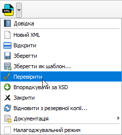
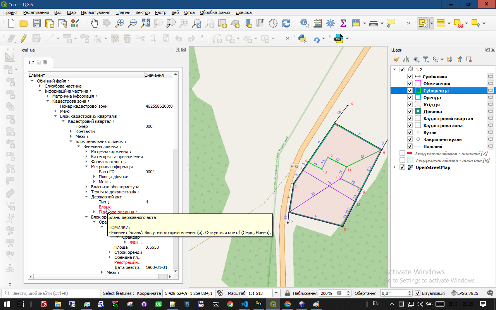
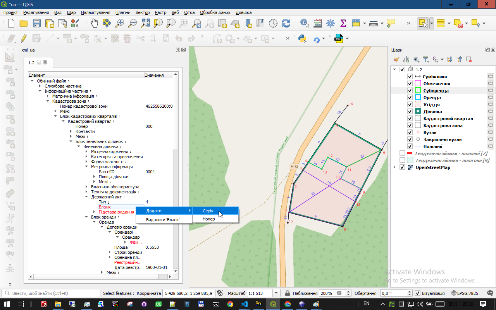

# Підказки під час роботи з XML

Плагін **xml_ua** допомагає помічати, що потрібно доопрацювати у кадастровому XML. Це не окрема перевірка, яку треба запускати після роботи, а підказки, що з'являються у реальному часі — просто під час редагування.

Не потрібно запускати перевірку щоразу після зміни даних або відкривати текстові протоколи з переліком помилок. Плагін одразу позначає проблемні місця: елементи чи значення, які потрібно виправити або додати, виділяються червоним.

---
На зображенні показано команду перевірки в меню. Щоб отримувати підказки під час редагування, запускати цю команду не потрібно.

---

## Щоб дізнатися, що саме потрібно зробити, наведіть вказівник миші на червоний елемент. З'явиться конкретна підказка — наприклад, який обов'язковий елемент бракує.

---

## Коли для виправлення потрібно додати або прибрати елемент, скористайтеся контекстним меню: клацніть по потрібному елементу правою кнопкою миші. У меню плагін покаже доступні дії.

Тож вам не потрібно шукати проблему в довгому протоколі чи самостійно згадувати всі вимоги. Дивіться, що виділено червоним, наведіть на це вказівник і скористайтеся підказкою.
