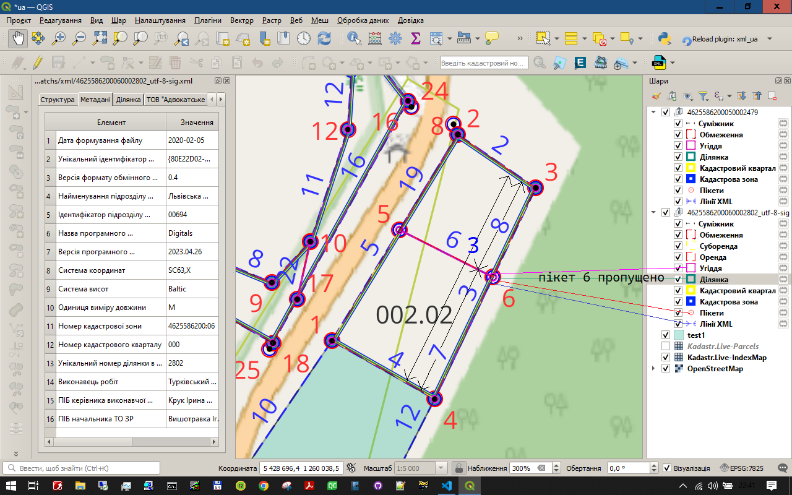

### Візуальний контроль геометрії XML-файлу

#### Застосування індивідуальних стилів для окремих шарів та інструменту QGIS **"Наближення"** для візуальної перевірки правильності геометрії XML-файлу.
---

#### Скріншот 1. Правильна геометрія ділянки.

---

На скріншоті 1. можна побачити збільшене, з допомогою інструменту **"Наближення"**, зображення частини ділянки, на якому відображаються пікети і лінії шарів так, щоб візуально було видно всю геометричну структуру xml. 

Лінії мають різну товщину, але зміщені всередину ділянки так, щоб не виходити за межі ділянки і можна було візуально бачити склад шарів кожної частини ділянки. 
Колір, стиль і товщина ліній зображені біля назви шару. 

Пікети відмічені концентричними кружками різного діаметру. Колір кружка пікету співпадає з кольором відповідної лінії так щоб можна було бачити шари, до складу яких входить даний пікет.

Таке оформлення дозволяє візуально перевірити відсутність типових помилок геометрії.

Серед іншого, на скріншоті 1. можна бачити, що: 
- пікет (точка) 15: 
  * не дублюється (бо поряд нема іншого номера) 
  * є створною (розміщена на лінії, без повороту межі) 
  * входить до складу всіх шарів 
- немає накладання Ліній XML 14, 15, 23, 26 (бо номери ліній розміщені посередині відрізків)

А отже, у даній частині ділянки нема топологічних помилок, таких як: 
- неповне перекриття шарів 
- лінійні елементи з нульовою довжиною 
- площинні елементи з нульовою площею 
- дублювання вершин 
- перекриття або розриви лінійних і площинних елементів.

---

#### Скріншот 2. Помилки у геометрії ділянки.

---
Натомість на скріншоті 2. можна побачити, що: Пікет (точка) 6 не входить до складу всіх шарів, а Лінія XML 3 перекривається Лініями XML 7 і 8.