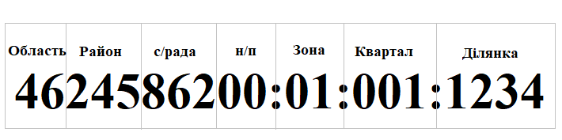

# Зона, квартал, ділянка: історія одного "сендвіча"

Коли ви відкриваєте або створюєте XML-файл у плагіні, то бачите дивну картину: ваша земельна ділянка ніби лежить на "сендвічі" з двох інших об'єктів — кадастровим кварталом та кадастровою зоною. При цьому всі три "шари" мають абсолютно однакові межі. Навіщо така конструкція і звідки вона взялася? Давайте розбиратися!

## Привіт з паперового минулого

Уявіть часи, коли не було комп'ютерів, а весь облік земель вівся на величезних паперових картах-планшетах. Щоб якось упорядкувати цей процес, територію кожної сільської ради ділили на частини.

1.  **Кадастрова зона:** Спочатку всю територію ділили на великі шматки — **зони**. Часто межі зон проходили по природних об'єктах (річках, лісах) або відповідали різним типам земель (наприклад, "зона полів", "зона пасовищ"). Кожна така зона отримувала свій номер і зображувалася на окремому аркуші паперу — **листі зони**.

2.  **Кадастровий квартал:** Далі кожну зону ділили на менші частини — **квартали**. Це вже були більш впорядковані, обмежені дорогами або просіками. Квартали також нумерували і малювали на окремих, більш детальних аркушах — **листах кварталів**.

3.  **Земельна ділянка:** І вже на цих "квартальних" аркушах креслили та нумерували окремі **земельні ділянки** громадян та організацій.

Отже, номер будь-якої ділянки складався з трьох частин: `номер зони` : `номер кварталу` : `номер ділянки`. Це було зручно в межах однієї сільради, але абсолютно не працювало в масштабах країни.

## Як народився кадастровий номер?

Щоб зробити цю систему єдиною для всієї України, до трьох старих номерів просто додали ще один — **код населеного пункту за класифікатором КОАТУУ**. Так і народився сучасний кадастровий номер, який є унікальним для кожної ділянки в країні.

> Детально, довго і нудно (але офіційно) структура кадастрового номера описана в <a href="https://zakon.rada.gov.ua/laws/show/1051-2012-%D0%BF#Text" target="_blank">Порядку ведення Державного земельного кадастру (Постанова КМУ №1051)</a>.

Ось як його структура виглядає на практиці:

<small>**Примітка 1:** Дві останні цифри коду КОАТУУ (номер села у складі ради) часто замінюють нулями. Це пов'язано з тим, що нумерація зон є спільною для всієї сільської ради і не залежить від конкретного села. Хоча в перших обмінних файлах з 2003 року тут могли бути інші цифри, згодом стало загальноприйнятою практикою використовувати `00`.</small>

<small>**Примітка 2:** Для ділянок, розташованих за межами населеного пункту, номер кадастрового кварталу, як правило, має значення `000`.</small>

## Чому в XML зона і квартал мають розмір ділянки?

На перших етапах комп'ютеризації керувати величезною кількістю дрібних файлів було складно. Тому було логічно об'єднувати всю інформацію (просторову та правову) про ділянки в межах одного кварталу чи зони у великі текстові файли.

З часом виникла потреба обмінюватися даними про **одну конкретну ділянку**. Щоб зберегти сумісність зі старими системами, в сучасному форматі XML залишили об'єкти зони та кварталу.

Але є нюанс: геодезист, який обміряв вашу ділянку, не мав координат усього кварталу чи зони. Тому **межі зони та кварталу просто прирівнюються до меж самої ділянки**.

<small>Ось чому ви бачите цей "сендвіч". Об'єкти зони та кварталу в сучасному XML-файлі — це такий собі рудимент. Зони та квартали збереглися для сумісності зі старою "архітектурою" даних, хоча в файлі для однієї ділянки вони вже не несуть того смислового навантаження, що й раніше.</small>